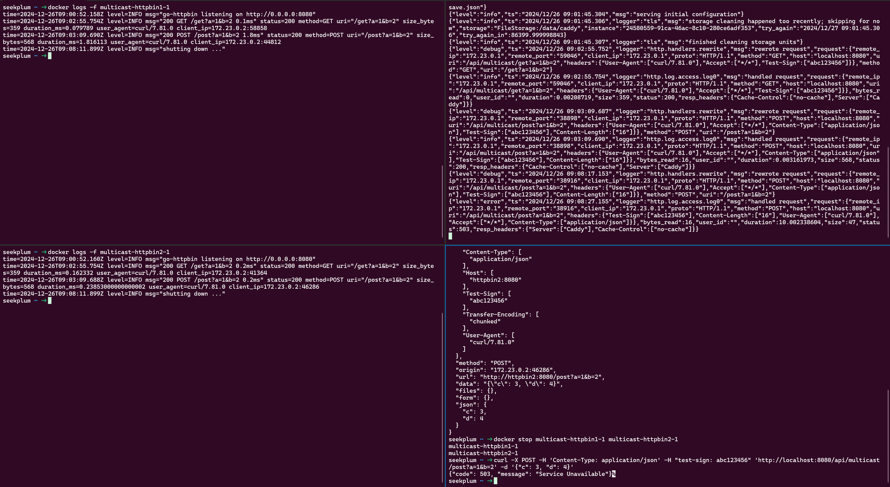

# Caddy 插件

## 概要

同时转发请求到多个后端服务器。



## Caddyfile 配置

```Caddyfile
:80 {
	...

	route /api/multicast/* {
		uri strip_prefix /api/multicast
		multicast {
			backends http://httpbin1:8080 http://httpbin2:8080
			mode all
		}
	}
}
```

## 启动服务

```bash
# 构建镜像
bash ./deploy.sh build

# 启动服务
bash ./deploy.sh up
```

## 测试接口

```bash
# GET 请求
curl -X GET -H "test-sign: abc123456" 'http://localhost:8080/api/get?a=1&b=2'

# 多个后端服务器
curl -X GET -H "test-sign: abc123456" 'http://localhost:8080/api/multicast/get?a=1&b=2'

# POST 请求
curl -X POST -H 'Content-Type: application/json' -H "test-sign: abc123456" 'http://localhost:8080/api/post?a=1&b=2' -d '{"c": 3, "d": 4}'
# 多个后端服务器
curl -X POST -H 'Content-Type: application/json' -H "test-sign: abc123456" 'http://localhost:8080/api/multicast/post?a=1&b=2' -d '{"c": 3, "d": 4}'

for i in {01..60}; do
  echo -n "$i ";
  curl -X POST -H 'Content-Type: application/json' -H "test-sign: abc123456" 'http://localhost:8080/api/multicast/post?a=1&b=2' -d '{"c": 3, "d": 4}';
  sleep 0.1;
  echo "";
done
```

## 停止服务

```bash
bash ./deploy.sh down
```
